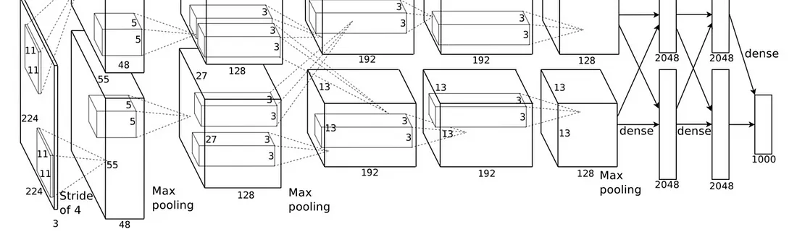

# K-IUM Medicl Image Competition

    K-IUM Celebral Anguiography Image Ai Model Competition
    (K-IUM 뇌 조형제 X-Ray 영상 인공지능 모델 대회)
    * datasets은 대회 지침에 따라 비공개
---
Table of Contents
1. [ Description. ](#desc)
2. [ Pre-requisite. ](#pre)
3. [ Project. ](#proj) <br>
    3-1. [ Libraries Load. ](#load) <br>
    3-2. [ Preprocessing. ](#preproc) <br>
    3-3. [ Modeling. ](#model) <br>
    3-4. [ Evaluation. ](#eval) <br>
4. [ Conclusions. ](#con)

<a name="desc"></a>
## 1. Description
- Datasets은 1000명정도의 환자들에 대한 뇌 조영술 영상 이미지
    - 한 명의 환자에 대해 8개의 각도에 따른 영상 이미지를 가지고 있는 수천명 환자의 이미지 데이터 셋
    - 환자가 동맥류인지 아닌지, 그리고 어느 위치에 동맥류가 있는지를 판단하는 CSV 파일


<a name="pre"></a>
## 2. Pre-requisite
### Convolutional Neural Networks
---
CNN(Convolutional Nerual Networks)는 본래 인간의 신경망 구조에서 아이디어를 착안한 인공 신경망 구조로써, Image & Audio Recognition과 Image Classification에서 자주 사용되는 신경망 기법이다.

- 이러한 CNN layer들은 input data(images)로 부터 features(특징)을 추출하는데 유용한 역할을 해준다.

- Conv layers들은 filters(also called kernels)를 사용해서 이미지에서 spatial knowlegde(공간적인 정보)를 가지고 있는 features(특징)을 추출한다.



### VGG-16
--- 
Oxfort Uniersity의 한 연구팀에서 제안한 컨볼루션 신경망으로써, 거대 규모 이미지 인식 대회인 (ILSVRC)에서 2014년 92.7%의 top-5 test 정확도의 성과를 보인 CNN Architecture이다.

- Layer를 깊게 구성할 수록, 더 높은 정확도를 보여 준다는 아이디어를 실험을 통해 보여주고 증명하였음

- 3 x 3 recpetive field의 개념의 우수성을 보여주었음

### ResNet
---
Resnet은 Residual Network에 대한 줄임말으로써, Residual Learning을 Main 제안으로 사용한다. 

- Residual Learning에 있어서, 어떠한 features를 learning하는 것보다는 Residual을 learning하는 것이 더 좋은 결과를 도출할 것이라는 아이디어(Skip_connection)가 반영된 것이다.

https://miro.medium.com/v2/resize:fit:1100/format:webp/1*LHjPgojb9DBsuR9_pHmaig.png

### Medical Iamging
---
Medical Imaging은 진단을 목적으로 사람의 몸에 관해서 View하기 위한 다양한 기술적인 방법을 말한다.

- CT scan, X-rays, MRI 등등이 있다.


<a name="proj"></a>
## 3. Project

<a name="load"></a>
### 3-1. Load Libraries & Datasets

Load Libraries
```
import os
from datetime import datetime
import cv2
import requests # Web Data Fetch

import numpy as np
import pandas as pd
import pathlib
import matplotlib.pyplot as plt
import seaborn as sns
from scipy import stats

print(cv2.__version__) # Should print 4.4.0
print(cv2.cuda)
```
Load Datasets
```

base_dir = "./"
print(os.getcwd()) # 현재 Directory가 올바른지 확인

train_imgs = [base_dir + "train_set/images/" + "{}".format(i) for i in os.listdir(train_img_dir) ]

train_label = pd.read_csv(base_dir + "train_set/train.csv")


print(train_imgs)

print("Total train images: ", len(train_imgs))

```
---
### 3-2. Data Checking (EDA)
---
```
...
```
---

### 3-2. Data Preprocessing
get the images
```
X = [] # images
y = []

count=0

img_size = 224
used_patient_num = 10

for patient_idx in range(0, used_patient_num):
    try :
        img_elem = []
        img_elem_equalize = []

        # Make a Image Bundle with 8 images read (img_elem)
        for sample_idx in range(0, 8):
            image_index = (patient_idx * 8) + sample_idx
            img_elem.append(cv2.imread(train_imgs[image_index],cv2.IMREAD_GRAYSCALE))


        # Make Noie Reduction, and Resize the all Image from the Image Bundle
        for i in range(0, 8):
            img_elem_equalize.append(cv2.equalizeHist(img_elem[i]))
            img_elem_equalize[i] = cv2.resize(img_elem_equalize[i],(img_size,img_size),interpolation=cv2.INTER_CUBIC)
            img_elem[i] = cv2.resize(img_elem[i],(img_size,img_size),interpolation=cv2.INTER_CUBIC)

        # Combine 8 images into 1 binary images with 8 channel
        img = np.dstack([img_elem[0], img_elem[1], img_elem[2], img_elem[3], img_elem[4], img_elem[5], img_elem[6], img_elem[7]])
        img_eq = np.dstack([img_elem_equalize[0], img_elem_equalize[1], img_elem_equalize[2], img_elem_equalize[3], img_elem_equalize[4], img_elem_equalize[5], img_elem_equalize[6], img_elem_equalize[7]])

        # Normalize Image Values
        img = img.astype(np.float32)/255.
        img_eq = img_eq.astype(np.float32)/255.

        print(img.shape)
        print(img_eq.shape)

        count=count+1

        X.append(img_eq) # Append the processed image to X(predictors)

    except:
        continue


```

get the lables from file
```
aneurysm = train_label.Aneurysm # Binary Label
y = aneurysm[0:used_patient_num]

location = train_label.drop(columns=['Index', 'Aneurysm']) # Location Label
```
---
### 3-3. ML Model Selection & Training
```
# Selected Model : VGG16 based on Keras Tensorflow

import tensorflow as tf
from tensorflow import keras
from tensorflow.keras import layers
from sklearn.model_selection import train_test_split

x_train, y_train = X, y

x_train, x_val, y_train, y_val = train_test_split( x_train, y_train, test_size=0.2,random_state=111 )

def cnn_block(input_layer,
                    cnn_num=3,
                    channel=64,
                    block_num=1):

    x = input_layer

    for c_num in range(cnn_num):
      x = keras.layers.Conv2D(filters=channel,
                              kernel_size=(3,3),
                              activation='relu',
                              kernel_initializer='he_normal',
                              padding='same',
                              name=f'block{block_num}_conv{c_num}')(x)

    x = tf.keras.layers.MaxPooling2D(
          pool_size=(2,2),
          strides=2,
          name=f'block{block_num}_pooling')(x)

    return x

def build_vgg(input_shape=(224,224,8),
              cnn_num_list=[2,2,3,3,3],
              channel_list=[64,128,256,512,512],
              num_classes=10):

    input = keras.layers.Input(shape=input_shape)
    x = input

    for i , (cnn_num, channel) in enumerate(zip(cnn_num_list, channel_list)):
        x = cnn_block(x, cnn_num, channel, i)

    x = keras.layers.Flatten(name='flatten')(x)
    x = keras.layers.Dense(4096, activation='relu', name='FC-4096-1')(x)
    x = keras.layers.Dense(4096, activation='relu', name='FC-4096-2')(x)
    x = keras.layers.Dense(1000, activation='relu', name='FC-1000')(x)
    x = keras.layers.Dense(1, activation='sigmoid', name='predictions')(x)


    model = keras.Model(
        inputs = input,
        outputs = x
    )

    return model

vgg_16 = build_vgg()

vgg_16.compile(
    loss = keras.losses.categorical_crossentropy,
    optimizer = tf.keras.optimizers.SGD(learning_rate=0.01, clipnorm=1.),
    metrics = ['accuracy'],
)

# history_16 = vgg_16.fit(x_train, y_train, epochs=10)

history_16 = vgg_16.fit(x_train, y_train,
                        batch_size=128,
                        epochs=10,
                        validation_data=(x_val, y_val))

```
---
### 3-4. Evaluation of the Model
---

<a name="con"> </a>
## 4. Reference
[(Analytics Vidhya) Lung Disease prediction using Medical Images](https://medium.com/analytics-vidhya/lungs-disease-prediction-using-medical-imaging-with-implementation-of-vgg-resnet-and-183e73b85df9)

[(Towards Data Science) Data Augmentation in Medical Images](https://towardsdatascience.com/data-augmentation-in-medical-images-95c774e6eaae)


[(Github) Meaningful resources for Medical Imaging](https://github.com/sfikas/medical-imaging-datasets)

[(Paper) Development of an Optimized Deep Learning Model for Medical Imaging](https://www.ncbi.nlm.nih.gov/pmc/articles/PMC9431842/)
